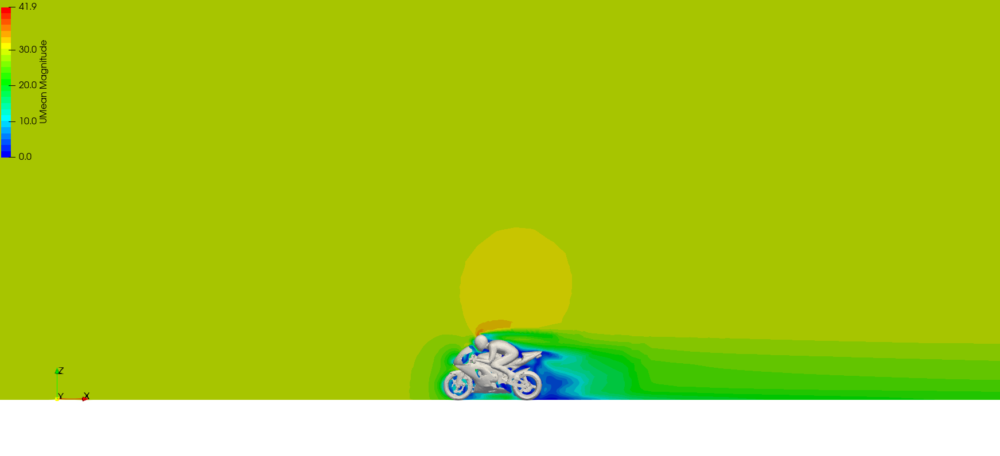
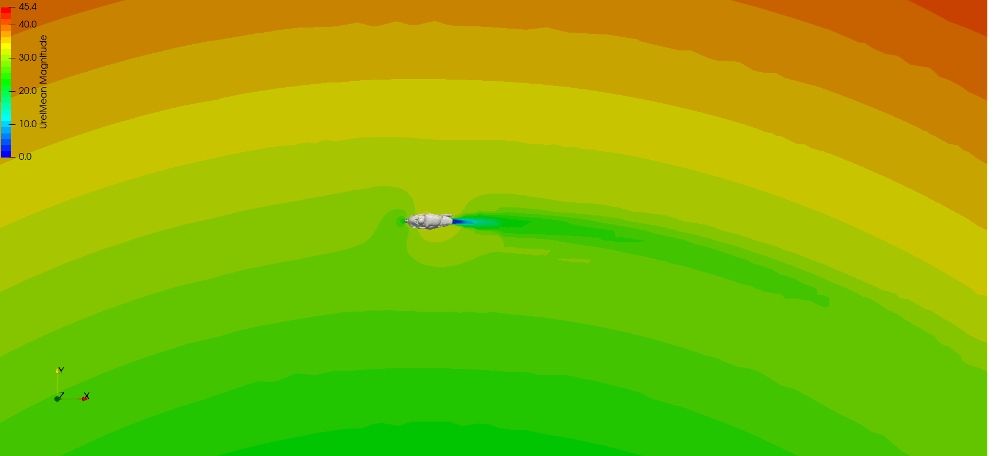

# caseSetup-dev: OpenFOAM Case Setup & Suspension Kinematics Framework

## Overview

caseSetup is a python framework that sets up OpenFOAM cases for external automotive aero. it handles the mesh config, boundary conditions, solver setup, cluster scripts and post-processing so you don't have to hand edit every dict.

two bigger features beyond the basic straight-line case:

- double wishbone + pushrod kinematic solver - works out the per-component transforms (translation, rotation, pivot) from a ride-height input and deforms the geometry so it follows the actual suspension motion, not just a vertical wheel shift.
- cornering (SRF) - solves the whole domain in a single rotating frame so the car follows a steady curved path. the rotating-frame solver, BCs, per-wheel rolling speeds and post fields are all set up automatically, and it ties into the ride-height study for per-point radius/direction.

### Fan pressure-jump condition

The `FAN` geometry prefix adds an ESI OpenFOAM `fan` pressure-jump condition for a planar fan disk. This is useful for modelling a fan in front of a radiator without resolving the blades. Use a separate `POR` geometry for the radiator porous region if a radiator pressure drop is also required. The FAN disk must be a single, approximately planar circular ASCII OBJ/STL surface and is currently supported through the snappyHexMesh path.

Example:

```ini
[GEOMETRY]
GEOM = body.obj.gz,1,8,5,1.1,high
  POR-radiator.obj.gz,1,10,6,1.4,high
  FAN-radiator-fan.obj.gz,1,10,0,1.0,high

[FAN-radiator-fan]
FAN_MODEL = fan
FAN_CENTER = default
FAN_DIRECTION = default
FAN_TARGET_GEOMETRY = POR-radiator
FAN_DIAMETER = default
FAN_PRESSURE_RISE = 250
SAMPLE_FAN = True
```

`FAN_CENTER` and `FAN_DIAMETER` can be calculated automatically from the disk. With `FAN_DIRECTION = default`, the surface normal is oriented toward `FAN_TARGET_GEOMETRY`; an explicit direction overrides the target. `FAN_PRESSURE_RISE` is in Pa. `SAMPLE_FAN` is retained in the generated setup metadata, but dedicated FAN reporting is not yet implemented. Validate the generated `fan` boundary condition with the installed ESI OpenFOAM release (`of2206` or `of2606`) before production runs.

---

## Customizing post-processing views and variables

The ParaView post-processing configuration is controlled by the `pvPostSetup` file in the case directory. When a case is generated, the default file is copied from `postUtilities/default/pvPostSetup`. Edit the copied case file rather than the repository default when changing one case.

The main switches are:

```ini
[PV_POST_MAIN]
CAMERA_VIEWS = default
VARIABLE_DICT = default

[SURFACE]
VIEWS = default
VARIABLES = default

[SLICE]
VIEWS = default
VARIABLES = default
LIC_VARIABLES = default

[ISO_SURFACE]
VIEWS = default
VARIABLES = default
```

`default` uses the built-in settings. To use custom settings, replace `VARIABLE_DICT` and/or `CAMERA_VIEWS` with paths to JSON-style dictionary files. The path must be readable from the directory where `pvPost.py` is run.

### Adding or changing a plotted variable

Copy [postUtilities/default/defaultVariables](postUtilities/default/defaultVariables) to a custom file, for example `myVariables`, and change the relevant entries. Variables are grouped by output type: `surfaceVariables`, `sliceVariables`, and `isoVariables`. Each variable has an equation, label, display range, and ParaView colour map.

For example, this entry adds a normalized mean streamwise velocity variable to the surface and slice dictionaries:

```json
"UMeanStreamwise": {
  "equation": "UMean_X/UREF",
  "label": "Umean,x/Uref",
  "range": [0, 1.2],
  "color": "Viridis (matplotlib)"
}
```

The variable name (`UMeanStreamwise`) is the name used in `pvPostSetup`. The equation may reference fields exported by OpenFOAM and the reference tokens `UREF`, `LREF`, and `WREF`; these tokens are replaced automatically using the case reference values. The field used by the equation must exist in the exported EnSight data.

Select the new variable for a plot by changing the corresponding `pvPostSetup` section. Multiple names are separated by spaces:

```ini
[PV_POST_MAIN]
VARIABLE_DICT = myVariables

[SURFACE]
VARIABLES = CpMean UMeanStreamwise CfMean

[SLICE]
VARIABLES = CpMean UMeanStreamwise
LIC_VARIABLES = UMean
```

The available variable groups and their display settings are defined in the custom variable file; the `VARIABLES` entries only select which names are rendered.

### Adding or changing camera views

Copy [postUtilities/default/defaultViews](postUtilities/default/defaultViews) to a custom JSON file, for example `myViews`. Each view contains:

```json
"DriverSide": {
  "pp": 1,
  "campos": "[0,-LREF*10,0]",
  "focalpos": "[1.18,0,0.85]",
  "viewup": "[0,0,1]",
  "parallelscale": "WREF/2"
}
```

`campos` is the camera position, `focalpos` is the point being viewed, `viewup` defines the top direction, and `parallelscale` controls the orthographic zoom. The expressions can use `LREF`, `WREF`, `CREF`, and `FREF`. Then select the custom views and names in `pvPostSetup`:

```ini
[PV_POST_MAIN]
CAMERA_VIEWS = myViews

[GEOM]
VIEWS = DriverSide

[SURFACE]
VIEWS = DriverSide FrontLeft

[SLICE]
VIEWS = DriverSide

[ISO_SURFACE]
VIEWS = DriverSide
```

The view names in `VIEWS` must exactly match keys in the custom view file. If a custom view file is not specified, the built-in views are generated automatically from the case reference dimensions.

### Front- and rear-wing pressure sections

`pvPost` can extract `CpMean` where a y-normal plane intersects the front or rear wing surface. Enable either section in the case `pvPostSetup` file. The default patch patterns are `frontWing.*` and `rearWing.*`, and matching is case-insensitive.

```ini
[FRONT_WING_PRESSURE]
ENABLE = True
PATCH_PATTERN = frontWing.*
NORMAL = default
Y_RANGE = default
N_PLANES = 11
VARIABLE = CpMean
OUTPUT_DIR = postProcessing/wingPressure

[REAR_WING_PRESSURE]
ENABLE = True
PATCH_PATTERN = rearWing.*
NORMAL = default
Y_RANGE = default
N_PLANES = 11
VARIABLE = CpMean
OUTPUT_DIR = postProcessing/wingPressure
```

With `NORMAL = default`, the plane normal is the SAE y direction `(0 1 0)`. `Y_RANGE = default` samples from `CREF_y - 0.5 WREF` to `CREF_y + 0.5 WREF`; use two values such as `[-0.4,0.4]` for an explicit range. `N_PLANES` controls the number of evenly spaced planes. An explicit normal can be supplied as three values, for example `NORMAL = 0 1 0`.

Each intersection is written as a CSV file containing `x`, `y`, `z`, and `CpMean` columns under `OUTPUT_DIR`. The feature is disabled by default and produces CSV data only; it does not change the existing surface, slice, or LIC image generation.

When using a generated cluster case, enable the required sections in the case copy of `pvPostSetup` before submitting the post-processing job. The standard `postPro` workflow runs `pvPost.py` first, which creates the CSV files when the sections are enabled, and then runs `postRun.py --wingPressure` to create the plots. No additional cluster setting is required beyond enabling the relevant section. The generated cluster command is available in the `post` section of the selected `clusterDict` template.

For local/manual processing, run `postRun.py` with `--wingPressure` after `pvPost.py` has completed. The selected cases are supplied with `--trial` in the same way as force plots:

```bash
python postUtilities/postRun.py --wingPressure --trial case001 case002 --saveFormat png
```

For each selected case, `postRun.py` reads the front- and rear-wing CSV files, plots `CpMean` against `x` for every available y plane, and writes separate plots to that case's `postProcessing/wingPressure` directory:

```text
frontWing_CpMean_vs_x.png
rearWing_CpMean_vs_x.png
```

The Cp axis is inverted following the conventional aerodynamic pressure-coefficient presentation. Cases without enabled wing extraction or without matching CSV files are reported and skipped.

---

## Compatibility

| Aspect | Support |
|--------|---------|
| **OpenFOAM Versions** | v2012 - v2606 (newer versions untested, should work though) |
| **Operating Systems** | Ubuntu 22.XX (preferred); Windows/macOS untested |
| **Python** | 3.8+ |

---

## Quick Start

1. Ensure your preferred version of OpenFOAM (v2012+) is installed
2. Create a directory structure as such:
```
projectDirectory/
├── 02_reference/                    # Location where reference files reside
│    └── MSH/                        # Where geometry files reside (.obj,.stl)
│
└── CASES/                           # Run directories reside in here
    ├── 001/                         # Run directory, where your simulation case resides
    │   ├── system/
    │   ├── constant/
    ├── 002/                        
    │   ├── system/
    │   ├── constant/
    ...
```
3. Navigate into your case directory and run the following:
```bash
python /path/to/caseSetup.py --new
```
This will generate a new caseSetup file that looks like this:
```
[DEFAULTS]
DEFAULT_MODULES = defaultGlobalControl defaultGlobalSimControl defaultBCSetup defaultGlobalDecomposition defaultGlobalMaterial defaultGlobalRefinement defaultRideHeight defaultCornering defaultPost
ADDON_MODULES =

[TITLES]
CASENAME = casename
CASEDESCRP = default description
JOBCODE = TS

[GEOMETRY]
GEOM = default.stl,1,8,5,1.1,high
```
The `DEFAULT_MODULES` line consists of the modules that are set to default values. To edit, remove that module from the line and re-run `caseSetup.py` to reveal the hidden module for editing. The coordinate system follows SAEJ1594. Remove `defaultBCSetup` to expose the settings for the inlet velocity and reference values, and to set the center of rotation for pitching moment.

4. Specifying your geometry can be done easily in the `[GEOMETRY]` section, for example:
```
[GEOMETRY]
GEOM = frontWing.obj.gz,1,8,5,1.1,high
  rearWing.obj.gz,1,8,5,1.1,high
  body.obj.gz,1,8,5,1.1,high
  ROTA-front-wheel-lhs.obj.gz,1,8,5,1.1,high
  ROTA-front-wheel-rhs.obj.gz,1,8,5,1.1,high
  ROTA-rear-wheel-lhs.obj.gz,1,8,5,1.1,high
  ROTA-rear-wheel-rhs.obj.gz,1,8,5,1.1,high
```
The `GEOM` columns are as follows:

`GEOMETRY_FILE, SCALE_FACTOR, REFINEMENT_LEVEL, NLAYERS, EXPANSION_RATIO, WALL_MODELLING`

`GEOMETRY_FILE` - Geometry file name (.obj/.stl, .gz compression is fine, must be ASCII format!)

`SCALE_FACTOR` - Scale factor to scale the geometry, unit conversion (Only works with snappyHexMesh)

`REFINEMENT_LEVEL` - Base refinement level for specified geometry, additional curvature and edge refinements added on where required, global settings exposed with `defaultGlobalRefinement`

`NLAYERS` - Number of inflation layers 

`EXPANSION_RATIO` - Expansion ratio

`WALL_MODELLING` - high/low, high: uses wall model, low: no wall model

NOTE: the `ROTA` prefix is to specify that part will get a rotating wall boundary condition, more information in the `documentation/source/caseSetupTUG.pdf`!

5. When all geometry is setup and your `BC_SETUP` is all done, run `caseSetup.py` to finish setting up the case.
6. Use the `meshingScript`, `solveScript`, `exportScript` to execute each part of the case. 
    
    NOTE: make sure to replace `/path/to/zeroTemplates` with the `zeroTemplates` path in this repo in `setupTemplates/default/defaultCluster/slurm/clusterDict`. Likewise replace `/path/to/bin/pvbatch` with the path to your local Paraview `pvbatch` installation, and `/path/to/postUtilities/` with the path to this local repo.

For more information about the options and settings, refer to the `documentation/source/caseSetupTUG.pdf` or reach out to me for clarification!

## Demo Cases
A motorbike demo case has been provided in the `motorbikeDemoCase` directory. Copy that file to a desired location and execute `caseSetup.py` in either the `baseDemo` or `cornerDemo` directories. Run the scripts in order of `meshingScript`, `solveScript`, `exportScript`. 

NOTE: Make sure to replace `/path/to/zeroTemplates` with the `zeroTemplates` path in this repo in `setupTemplates/default/defaultCluster/slurm/clusterDict`. Likewise replace `/path/to/bin/pvbatch` with the path to your local Paraview `pvbatch` installation, and `/path/to/postUtilities/` with the path to this local repo. An example `clusterDict` has been provided in `setupTemplates/default-local`




## Directory Structure

```
caseSetup-dev/
├── caseSetup.py                    # Main entry point (command-line interface)
├── utilities.py                    # Core geometry/suspension utilities
├── writeSystem.py                  # OpenFOAM system/ directory generators
├── writeConstant.py                # OpenFOAM constant/ directory generators
├── writeScripts.py                 # Solver and cluster script generators
├── testing.py                      # Development/testing utilities
├── compileFiles.sh                 # PyInstaller compilation script
├── README.md                       # This file
│
├── setupTemplates/                 # Case setup templates
│   ├── default/                    # Standard automotive aerodynamics setup
│   │   ├── defaultANSA/            # ANSA mesh configuration
│   │   ├── defaultBCTemplates/     # Boundary condition templates
│   │   ├── defaultCluster/         # Cluster/HPC submission configs
│   │   ├── defaultDicts/           # OpenFOAM dict templates
│   │   ├── defaultPost/            # Post-processing setup
│   │   ├── defaultRefinements/     # Mesh refinement definitions
│   │   └── defaultSetup/           # Ride-height & general config
│   └── otr/                        # Optimal Test Run setup variant
│       ├── defaultANSA/
│       ├── defaultBCTemplates/
│       ├── defaultCluster/
│       ├── defaultDicts/
│       ├── defaultPost/
│       ├── defaultRefinements/
│       ├── defaultFidelity/        # Fidelity-specific settings
│       └── defaultSetup/
│
├── zeroTemplates/                  # OpenFOAM time-zero (initial condition) templates
│   ├── boundaryConditions/         # BC definitions for walls, inlets, outlets
│   ├── models/                     # Turbulence model templates
│   └── solvers/                    # Solver-specific templates (simpleFoam, pimpleFoam, etc.)
│
├── meshUtilities/                  # Mesh generation & analysis tools
│   ├── ansaMesh.py                 # ANSA mesh import/export utilities
│   ├── fidelityMesh.py             # Fidelity mesh integration
│   └── _obsolete/                  # Legacy mesh scripts
│
├── postUtilities/                  # Post-processing & results analysis
│   ├── pvPost.py                   # ParaView automation & field extraction
│   ├── postRun.py                  # Post-run analysis orchestration
│   ├── summary.py                  # Results summary generation
│   ├── plotForces.py               # Force coefficient visualization
│   ├── forceConvergencePlot.py     # Convergence analysis
│   ├── createMovies.py             # Animation generation
│   ├── pptGeneration.py            # PowerPoint report generation
│   ├── resultLogWriter.py          # Results logging
│   ├── gsheetExport.py             # Google Sheets export
│   ├── estimateStatisticalError.py # Uncertainty quantification
│   ├── changeCoeff.py              # Force coefficient post-processing
│   ├── postProReportGen.py         # Report generation orchestrator
│   ├── postProReportTemplate/      # LaTeX report templates
│   ├── pptGeneration/              # PowerPoint templates
│   ├── default/                    # Default config & setup files
│   └── _obsolete/                  # Legacy post-processing scripts
│
├── preUtilities/                   # Pre-processing utilities
│   ├── archiveCase.py              # Case archival/backup utilities
│   └── copyTrial.py                # Trial case copying/cloning
│
├── rideHeightUtils/                # **Suspension Kinematics System**
│   ├── doubleWishbonePushrodKinematics.py  # Core kinematic solver
│   ├── suspensionHardpoints_template.cfg   # Hardpoint geometry template
│   ├── suspensionHardpoints_template.json  # JSON format alternative
│   ├── rideHeightConfig                    # Ride-height configuration
│   └── rideHeightMorph.py                  # Suspension morphing utilities
│
├── documentation/                  # Project documentation
│   └── source/                     # LaTeX/technical documentation
│
└── addTemplates/                   # (Not shown) Additional custom templates
```

---

## Core Modules

### caseSetup.py - main entry point

the command-line entry point. it links the geometry, sets up the mesh, solver and BCs, and runs the ride-height study if it's turned on.

**Usage**:
```bash
# Standard case setup
python caseSetup.py 

# Create new caseSetup template
python caseSetup.py --new

# Ride-height study: set RUN_RIDE_HEIGHT = True in caseSetup, then run normally.
# caseSetup builds the child cases and re-invokes itself with --rideHeightMode
# internally (do not pass --rideHeightMode yourself). I mean you could if you want to re-set up the child case, it just ignores the ride height mapping module and skips linking the geometries, prevents infinite loops...
python caseSetup.py

# Options:
#  -s, --setup            Setup template type (default: 'default')
#  -d, --controlDict      Write controlDict only
#  --new                  Create new caseSetup file
#  --modules              Show available modules
#  --postProDict          Copy post-processing config
#  --rideHeightMode       INTERNAL ONLY (used by caseSetup when re-running child cases)
```

### Creating a custom setup template from an existing template

Use `--setup` to select a directory under `setupTemplates`. To create a custom setup based on an existing one, copy the complete setup directory rather than only its `defaultSetup` subdirectory. The other directories contain the matching boundary-condition, OpenFOAM dictionary, post-processing, refinement, and cluster templates used by `caseSetup`.

For example, create a local setup called `mySetup` from the repository's `default` setup:

```bash
cd /path/to/caseSetup-dev
cp -R setupTemplates/default setupTemplates/mySetup
```

Then edit the copied default settings:

```text
setupTemplates/mySetup/defaultSetup/
```

Typical files to customise include:

- `defaultModules` and `defaultOrder` — which setup modules are available and their order.
- `defaultGlobalControl`, `defaultGlobalSimControl`, and `defaultTitles` — general run and case defaults.
- `defaultGlobalRefinement` and `defaultGeometry` — mesh and geometry defaults.
- `defaultPVPost` and `defaultPost` — post-processing defaults.
- `defaultRideHeight` and `defaultCornering` — optional motion and cornering defaults.

Run the case using the copied template:

```bash
python caseSetup.py --setup mySetup
```

The value passed to `--setup` must match the directory name exactly. Keep the complete directory layout from the source template, including `defaultBCTemplates`, `defaultDicts`, `defaultPost`, `defaultRefinements`, and `defaultCluster`. If the custom template is intended for a cluster, update its `defaultCluster/slurm/clusterDict` paths and commands for that machine. Existing generated cases are not changed when the template is edited; regenerate or rerun `caseSetup` as appropriate.

### utilities.py - core geometry & kinematics engine

does most of the heavy lifting:
- loads and parses the suspension hardpoints (CFG/INI)
- drives the kinematic solver (DoubleWishbonePushrodSolver)
- works out the per-component transforms (WHEEL, UCA, LCA, ROCKER, PUSHROD, DAMPER, TIE)
- transforms the OBJ/STL geometry
- builds the ride-height child cases

main functions:
- `calculateRideHeights()` - pitch, roll, heave and wheel motion from the ride-height file
- `_load_suspension_kinematics_setup()` - load hardpoints and sanity-check the kinematic setup
- `_compute_component_transforms()` - per-component translation/rotation/pivot from the solver state
- `_categorize_pid_keywords_by_component()` - map geometry PIDs onto suspension components
- `transformGeom()` - apply the per-component transforms to the geometry files
- `transformGeometryByPIDRegex()` - PID-aware geometry transform with regex matching

### writeSystem.py - OpenFOAM system directory

writes the `system/` dir:
- `blockMeshDict` - background mesh
- `snappyHexMeshDict` - refinement & snapping
- `decomposeParDict` - parallel decomposition
- `controlDict` - time stepping & output
- `fvSchemes`, `fvSolution` - discretisation & solver schemes

### writeConstant.py - OpenFOAM constant directory

writes the `constant/` dir:
- turbulence model
- material properties
- geometry BC patches
- transport properties

### writeScripts.py - job submission & run scripts

writes the cluster/run scripts:
- SLURM, PBS, SGE configs
- mesh, solve, export, post pipelines
- job monitoring and result export
- needs a couple of tweaks in clusterDict (see below)

### meshUtilities/ - mesh tools

- **ansaMesh.py**: ANSA mesh import/export
- **fidelityMesh.py**: meshing in Cadence Fidelity (WIP)
- **getStats.py**: mesh quality metrics (aspect ratio, orthogonal quality, etc.)

### postUtilities/ - results processing

- **pvPost.py**: automated ParaView field images (pressure, velocity, etc.)
- **plotForces.py**: force coefficient time history and convergence plots
- **summary.py**: compact summary with the aero coefficients
- **pptGeneration.py**: auto powerpoint report
- **postProReportGen.py**: LaTeX technical report

### rideHeightUtils/ - suspension kinematics

#### doubleWishbonePushrodKinematics.py
the kinematic solver for a double-wishbone + pushrod corner:
- solves the 3D linkage constraints
- outputs per ride-height: wheel center, rotation (camber/toe), rocker angle, damper stroke
- feeds `utilities.py` for the geometry transform

#### suspensionHardpoints_template.cfg
the suspension geometry for each corner (FL, FR, RL, RR).

per-corner sections `[SUSP_FL]`, `[SUSP_FR]`, `[SUSP_RL]`, `[SUSP_RR]`:
- kinematic points:
  - `WHEEL_CENTER_STATIC` - static wheel position
  - `UCA_F_INNER`, `UCA_R_INNER`, `UCA_OUTER_STATIC` - upper control arm chassis/wheel mounts
  - `LCA_F_INNER`, `LCA_R_INNER`, `LCA_OUTER_STATIC` - lower control arm chassis/wheel mounts
  - `TIE_INNER`, `TIE_OUTER_STATIC` - tie rod mounts
  - `PUSHROD_OUTER_STATIC` - pushrod-to-rocker joint
  - `ROCKER_PIVOT`, `ROCKER_AXIS` - rocker rotation center and axis
  - `ROCKER_PUSHROD_JOINT_REF`, `ROCKER_DAMPER_JOINT_REF`, `ROCKER_DAMPER_CHASSIS` - rocker joint refs
  - `WHEEL_AXIS_LOCAL`, `WHEEL_FORWARD_LOCAL` - wheel orientation vectors

- PID keywords (any key with `PID` in the name):
  - `FL_UCA_PID`, `FL_LCA_PID`, `FL_ROCKER_PID`, `FL_PUSHROD_PID`, `FL_DAMPER_PID`, `FL_TIE_PID`, `FL_WHEEL_PID`
  - matched case-insensitive, substring, against the geometry PIDs to pick which transform to apply
  - same pattern for FR, RL, RR with the fr/rl/rr prefixes
  - the classifier takes the full name or a common abbreviation, so `flprod` or `rlpr` still come out as PUSHROD:

    | Component | Accepted keyword aliases |
    |-----------|--------------------------|
    | UCA       | `uca` |
    | LCA       | `lca` |
    | ROCKER    | `rocker`, `rock`, `rkr` |
    | PUSHROD   | `pushrod`, `prod`, `pshrd`, `push`, `pr` |
    | DAMPER    | `damper`, `damp`, `shock`, `strut` |
    | WHEEL     | `wheel`, `whl` |
    | TIE       | `tie`, `tierod`, `trod` |

---

## Setup & Configuration

### Case Directory Structure

```
CASES/
└── 001/
    ├── caseSetup                      # Configuration file (INI format)
    ├── constant/
    │   ├── triSurface/               # Geometry files (OBJ/STL)
    │   ├── transportProperties
    │   ├── turbulenceProperties
    │   └── ...
    ├── system/
    │   ├── blockMeshDict
    │   ├── snappyHexMeshDict
    │   ├── controlDict
    │   ├── fvSchemes
    │   ├── fvSolution
    │   └── ...
    ├── 0/                            # Initial conditions (created after mesh)
    └── postProcessing/               # (Generated after solver run)
```


### Ride-Height Input CSV

```csv
point,fl,fr,rl,rr,yaw,steer
1,0.05,0.05,0.02,0.02,0.0,0
2,0.10,0.10,0.05,0.05,0.0,5
3,-0.05,-0.05,-0.02,-0.02,0.0,0
```

Where:
- `fl, fr, rl, rr` = wheel vertical displacements (meters or mm depending on `RH_UNIT`)
- `yaw` = vehicle yaw angle (degrees, 0 for straight)
- `steer` = optional front road-wheel steer angle in degrees at the reference (front-left) wheel. the kinematic solver finds the rack travel that gives this angle at the front-left, then applies the same rack to the front-right so the Ackermann difference falls out on its own. the tie-rod inner joint slides along the rack axis (`RACK_AXIS` in the hardpoint file, default lateral `0 1 0`) and the tie-rod length is kept. leave blank or `0` for no steer. rear wheels aren't steered.

---

## Per-Component Transform System

### How It Works

ride-height point (corner displacements + yaw) goes in, the kinematic solver works out the wheel position, rotation, rocker angle and damper stroke, then for each component it builds a transform (translation, rotation axis-angle in radians, pivot). those get applied to the matching PIDs in the OBJ/STL, and out comes geometry that follows the suspension motion.

### Component Transform Details

| Component | Translation | Rotation | Pivot |
|-----------|-------------|----------|-------|
| **WHEEL** | Wheel center displacement from solver | Rotation vector from solver (camber/toe) | Static wheel center |
| **UCA** | Outer point moves with wheel | Computed from linkage geometry change | Midpoint of chassis mounts |
| **LCA** | Outer point moves with wheel | Computed from linkage geometry change | Midpoint of chassis mounts |
| **ROCKER** | Zero (rotates in place) | Rocker angle × rocker axis | Rocker pivot |
| **PUSHROD** | Inherits from rocker | Inherits from rocker | Rocker pivot |
| **DAMPER** | Inherits from rocker | Inherits from rocker | Rocker pivot |
| **TIE** | Follows wheel translation | Computed from linkage geometry change | TIE_INNER (chassis mount) |

### Rotation Computation (UCA/LCA/TIE)

rigid-body fit off the linkage vectors:
1. static linkage vector: chassis mount to wheel attachment in the static config
2. current linkage vector: same thing after the wheel has moved
3. rotation axis: cross product of the normalised vectors (perpendicular to both)
4. rotation angle: arccos of the dot product
5. rotation vector: `axis x angle` (axis-angle, radians)

that way the arms swing the way they actually would while keeping the pivot distances fixed.

---

## Cornering (SRF) Simulation

cornering solves the whole domain in a single rotating frame (SRF) spinning at `omega` about a vertical axis through the corner centre, so the car follows a steady circle of radius `CORNER_RADIUS` at `INLET_MAG`:

```
|omega| = INLET_MAG / CORNER_RADIUS    (rad/s)
```

set `RUN_CORNERING = True` and the case reconfigures itself:

- **solver**: the SRF solver (steady `SRFSimpleFoam`, transient auto-upgrades to `SRFPimpleFoam`). it solves the relative velocity `Urel`.
- **BCs**: the x/y outer walls become `srfFreestream`, the ground becomes an SRF moving wall, the roof stays slip. the inertial freestream `UInf` is zero - all the wind comes from the rotation.
- **per-wheel rolling speed**: each wheel rolls at `V_local = |omega| * (distance from the corner axis to the wheel centre)`, so inner wheels spin slower and outer wheels faster than `INLET_MAG`.
- **symmetry**: the flow isn't laterally symmetric, so `SIM_SYM = half` gets forced to `full`.
- **post**: anything that would read `UMean` switches to `UrelMean` (the rotating-frame average).
- **domain check**: the box only looks like a curved tunnel when it's narrow next to the radius, so it requires `CORNER_RADIUS >= CORNER_CLEARANCE_FACTOR * (DOMAIN_SIZE_y / 2)` and bails with the min radius otherwise.

### Configuration

edit the `[CORNERING_SETUP]` block in `caseSetup`:

```ini
[CORNERING_SETUP]
RUN_CORNERING = False           # master switch
CORNER_RADIUS =                 # turn radius of REFCOR (m); required when enabled
CORNER_DIR = left               # turn direction: left | right
CORNER_CENTER = default         # rotation centre 'x y z', or 'default' to derive from REFCOR
CORNER_CLEARANCE_FACTOR = 3     # min radius = factor * (DOMAIN_SIZE_y / 2)
CORNER_SOLVER = SRFSimpleFoam   # SRF solver app
```

| Key | Default | Description |
|-----|---------|-------------|
| `RUN_CORNERING` | `False` | master switch, `True` solves the case as an SRF cornering frame |
| `CORNER_RADIUS` | (empty) | path radius of REFCOR in metres. needed when cornering is on (or supply a per-point `corner_radius` CSV column) |
| `CORNER_DIR` | `left` | turn direction. `left` puts the centre on the car's left (-y), `right` on the right (+y) |
| `CORNER_CENTER` | `default` | explicit centre as three floats `x y z`, or `default` to derive it from REFCOR with a `+/- CORNER_RADIUS` offset in y |
| `CORNER_CLEARANCE_FACTOR` | `3` | sets the min radius relative to the domain half-width, keeps the box-vs-annulus approximation honest |
| `CORNER_SOLVER` | `SRFSimpleFoam` | SRF solver app. steady uses `SRFSimpleFoam`, transient auto-upgrades to `SRFPimpleFoam` |

### Cornering With Ride-Height Studies

with both `RUN_CORNERING` and `RUN_RIDE_HEIGHT` on, the ride-height CSV can drive the corner per point with two optional columns:

```csv
point,fl,fr,rl,rr,yaw,steer,corner_radius,corner_dir
1,0.05,0.05,0.02,0.02,0.0,8,30,left
2,0.10,0.10,0.05,0.05,0.0,-6,45,right
```

- `corner_radius` - per-point radius (m), overrides the base `CORNER_RADIUS` for that child case. bad/missing values fall back to the base.
- `corner_dir` - per-point `left`/`right`, overrides the base `CORNER_DIR`. bad/missing values fall back to the base.

every child case re-runs the domain check, so an out-of-range per-point radius fails fast.

---

## Usage Workflow

### Step 1: Create New Case

```bash
cd CASES/001
python ../caseSetup.py --new
# edit the caseSetup file with your parameters
```

### Step 2: Enable Kinematic Solver (Optional)

edit `caseSetup` and set up the `[RIDE_HEIGHT_SETUP]` block:
```ini
[RIDE_HEIGHT_SETUP]
RUN_RIDE_HEIGHT = True              # master switch for ride-height study
RIDE_HEIGHT_FILE = rideHeightConfig # CSV of ride-height points
RUN_RH_POINTS = 1 2 3 4 5           # subset of point indices to build
USE_DEPEND = True
RH_UNIT = mm                        # unit of corner displacements (mm | m)
INIT_RH =
RH_REF_WIDTH =
RH_REF_LEN =
USE_KINEMATIC_SOLVER = True         # enable double-wishbone + pushrod solver
HARDPOINT_FILE = /path/to/suspensionHardpoints_template.cfg
HARDPOINT_SCALE = 0.001             # 0.001 if hardpoints in mm, 1.0 if in m
SUSP_REQUIRE_ALL_PIDS_MATCHED = False
```

| Key | Description |
|-----|-------------|
| `RUN_RIDE_HEIGHT` | master switch, `True` builds one child case per ride-height point |
| `RIDE_HEIGHT_FILE` | name/path of the ride-height CSV |
| `RUN_RH_POINTS` | space-separated list of point indices (from the CSV) to build |
| `USE_DEPEND` | not operational at this moment |
| `RH_UNIT` | unit of the corner displacements in the CSV (`mm` or `m`) |
| `INIT_RH` | optional initial/reference ride-height offset, not operational at this moment |
| `RH_REF_WIDTH`, `RH_REF_LEN` | optional reference track width / wheelbase, not operational at this moment |
| `USE_KINEMATIC_SOLVER` | turn on the per-component kinematic deform (otherwise just a vertical wheel shift) |
| `HARDPOINT_FILE` | path to the suspension hardpoint CFG (needed if the solver's on) |
| `HARDPOINT_SCALE` | coordinate-to-metre multiplier (`0.001` for mm, `1.0` for m) |
| `SUSP_REQUIRE_ALL_PIDS_MATCHED` | `True` errors on any unmatched part, `False` leaves it alone with a warning |

prep the hardpoint file (copy the template and update the coordinates):
```bash
cp rideHeightUtils/suspensionHardpoints_template.cfg /path/to/suspensionHardpoints.cfg
# edit the suspension coordinates in the CFG
```

add the PID keywords to the geometry (any key with `PID` in the hardpoint CFG sections):
```ini
[SUSP_FL]
...
FL_WHEEL_PID = flwheel
FL_UCA_PID = fluca
FL_LCA_PID = fllca
FL_ROCKER_PID = flrocker
FL_PUSHROD_PID = flprod
FL_DAMPER_PID = fldamper
FL_TIE_PID = fltie
...
```
the keyword has to be a substring of the actual part/group name in the OBJ/STL (e.g. `fllca` matches a part named `body_susp_fllca`).

### Step 3: Setup Case

```bash
# standard mesh + BC setup. if RUN_RIDE_HEIGHT = True this
# builds the per-point child cases for you.
python ../caseSetup.py
```

> **Note:** `--rideHeightMode` is an internal flag caseSetup passes to itself when it re-runs inside each child case. don't pass it yourself, just set `RUN_RIDE_HEIGHT = True` and run caseSetup normally.

### Step 4: Process Ride-Height Points

if ride-height mode is on, you get one child case per point:
```
001_1/     # ride-height point 1
001_2/     # ride-height point 2
...
```

each child case has:
- the geometry deformed to follow the suspension
- domain pitch/roll/heave updated
- its own caseSetup with the point's parameters

### Step 5: Run Solver

```bash
cd 001_1/
blockMesh
snappyHexMesh
# run the solver (OpenFOAM command or cluster submission)
# or run the generated bash scripts in order: meshScript, solveScript, exportScript
# (postScript is called by exportScript when it's done)
```

### Step 6: Post-Process Results

```bash
python ../postUtilities/postRun.py
# gives you:
# - force convergence plots
# - pressure/velocity field plots
# - summary stats
# - powerpoint report (optional)
```

---

## Compilation

PyInstaller builds a standalone executable (handy for deployment):

```bash
bash compileFiles.sh
```

you get `dist/caseSetup` with all the templates and utilities bundled in.

---

## Additional Features

### Multi-Point Ride-Height Mapping

one case per ride-height point (e.g. accel, braking, cornering):

```csv
point,fl,fr,rl,rr,yaw
1,0.05,0.02,-0.02,-0.05,0.0      # accel
2,-0.02,-0.05,0.05,0.02,0.0      # braking
3,0.00,-0.08,0.08,0.00,5.0       # yaw + roll
```

run with `--rideHeightMode` (only caseSetup itself should pass this!):
```bash
python caseSetup.py --rideHeightMode
```

builds a child case per point with the suspension geometry already deformed.

### Mesh Fidelity Control

refinement regions live in `defaultRefinements/`:
- surface layers
- local refinement zones
- boundary layer y+

### Custom Turbulence Models

drop new models in `zeroTemplates/models/`. already there:
- k-omega SST
- Spalart-Allmaras (SA)
- k-epsilon (standard)

### Cluster Submission

auto-generate the SLURM/PBS scripts:
```bash
# edit the defaultCluster/clusterDict templates with your HPC settings.
# the default setup template just outputs plain bash scripts.
python caseSetup.py 
# generates: meshScript, solveScript, exportScript, postScript
# in setupTemplates/default/defaultCluster/slurm/clusterDict you need to:
#  - point solveScript at the zeroTemplates dir (in this repo)
#  - point postScript at the ParaView pvbatch command
```

---

## Troubleshooting

### Kinematic Solver Fails
- check the hardpoint CFG syntax (INI format, exact key names)
- make sure all the required keys are there (see the template)
- check the suspension geometry is actually feasible (no links crossing)

### Geometry Misaligned After Transform
- check the PID keywords match the geometry group names
- check the ride-height input (corner displacements too big?)
- check the pivot points in the hardpoint CFG

### "PID scan skipped" / Unmatched PID
- "PID scan skipped" means a geometry couldn't go through the PID-aware path (unsupported or binary), so it falls back to simple wheel translation. use ASCII OBJ/STL for the suspension parts.
- "Unmatched PID" means a hardpoint keyword doesn't show up in any part/group name. check the keyword is a substring of the real part name, or add an alias.
- check the per-part transform log next to each output geometry (`*.susp_pid_transform.json` / `.csv`) to see what actually moved.
- check `HARDPOINT_SCALE` matches the unit of your hardpoint coordinates (`0.001` for mm).

### Cornering (SRF) Errors
- **"CORNER_RADIUS must be a positive number"**: set `CORNER_RADIUS` in `[CORNERING_SETUP]`, or give a per-point `corner_radius` column in the ride-height CSV.
- **"CORNER_RADIUS is too small for this domain"**: the radius breaks `CORNER_RADIUS >= CORNER_CLEARANCE_FACTOR * (DOMAIN_SIZE_y / 2)`. bump `CORNER_RADIUS`, shrink `DOMAIN_SIZE` in y, or drop `CORNER_CLEARANCE_FACTOR`.
- **`SIM_SYM = half` warning**: cornering isn't laterally symmetric so it's forced to `full`. set `SIM_SYM = full` to quiet it.
- **no velocity field in post**: cornering averages `UrelMean` not `UMean`. the post tools catch this on their own, just make sure the case was actually solved with cornering on.

### Memory Issues with Large Meshes
- turn on parallel decomposition in `system/decomposeParDict`
- back off the refinement in `snappyHexMeshDict`
- split the case into smaller domains

---

## Performance & Scalability

- mesh generation: ~minutes (depends on refinement)
- kinematic solve: ~ms per ride-height point
- geometry transform: ~seconds per component (depends on OBJ/STL size)
- CFD solve: hours to days (use the HPC for production runs)

---

## License & Attribution

built on OpenFOAM and community work. see the individual module headers for specific acknowledgments.

---

## Version History

| Version | Date | Changes |
|---------|------|---------|
| **4.2.2** | 2026 | cornering (SRF): rotating-frame solver/BC/field setup, kinematic ride height solver, ride height mapping|
| 4.1.1 | 2025 | updates to postProcessing and ANSA mesh integration |
| 4.0 | 2024 | complete re-write with multi-setup template framework |
| 3.* | 2024 | more functionality |
| 2.* | 2023 | added functionality for porous media and wheel MRF |
| 1.* | 2022 | Birth of this concept |

---

## Support & Contact

for issues, questions or contributions, check the docs or ping the maintainers.

